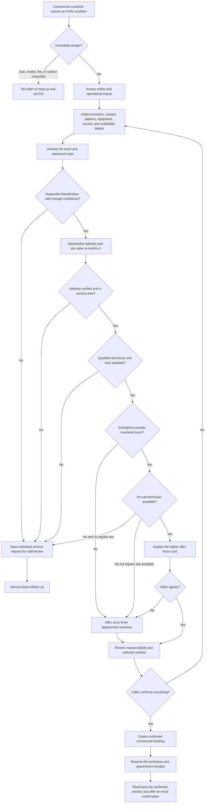

# LiveKit HVAC Voice Agent

1. Copy `.env.example` to `.env` and add your LiveKit credentials.
2. Run `uv sync`.
3. Run `uv run python agent.py console` for a local voice test.
4. Run `uv run python agent.py dev` for a LiveKit call test.

## Commercial fix request flow

