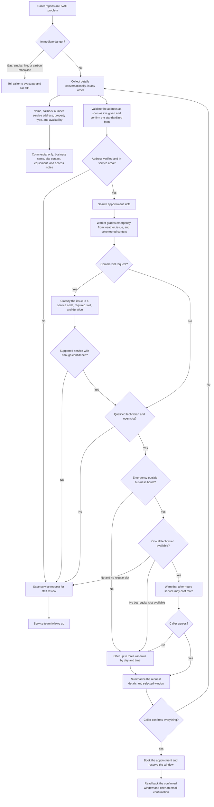

## Summit Air Voice Agent

This project implements a Voice AI agent that handles front-desk responsibilities for Summit Air, an HVAC company.

The agent is hosted on LiveKit and built with the LiveKit Agents framework for Python. It uses Deepgram Nova-3 STT, Google Gemini 3.7 Flash, Inworld TTS, and LiveKit’s turn detector for conversational turn-taking.

The agent can verify service addresses (uses Google Maps address verification API), check local weather conditions, search and book appointments, and send email confirmations. Deterministic scheduling, commercial-service classification, emergency assessment, customer memory, and escalation logic run in a Cloudflare Python Worker, with Cloudflare KV providing lightweight persistent storage (the choice of storage is purely for the convenience of implementation for the demo, there is a risk of cocurrency errors with this implementation at production scale).

For this demonstration, requests that require human review are recorded and displayed in a simple dispatch portal. See [Start the dispatch portal](#start-the-dispatch-portal) for instructions. The project also includes [seeded data](./SEEDED_DATA.md), which makes it easier to review features such as address verification, commercial request routing, emergency assessment, and after-hours dispatch.

## Prompt and LLM logic

For the convenience of the reviewer and for long-term maintainability, the LLM-facing prompt logic is isolated in two files:

- [`prompts.py`](./prompts.py) contains the voice agent's conversation, workflow, safety, privacy, and function-use instructions.
- [`cloudflare_worker/src/prompts.py`](./cloudflare_worker/src/prompts.py) contains the worker's commercial-service and emergency-classification instructions.


## Standard request flow



## Start the dispatch portal

From the project root, start the Cloudflare Worker:

```bash
cd cloudflare_worker
npx --yes wrangler dev --env-file ../.env
```

Then open [http://localhost:8787/dashboard](http://localhost:8787/dashboard) in a browser. Keep the Worker running while using the portal. Requests that require human review will appear in its dispatch queue.

## AI USE Acknowledgment 

Claude Fable 5 and Codex GPT-5.6 Sol were used to assist with development